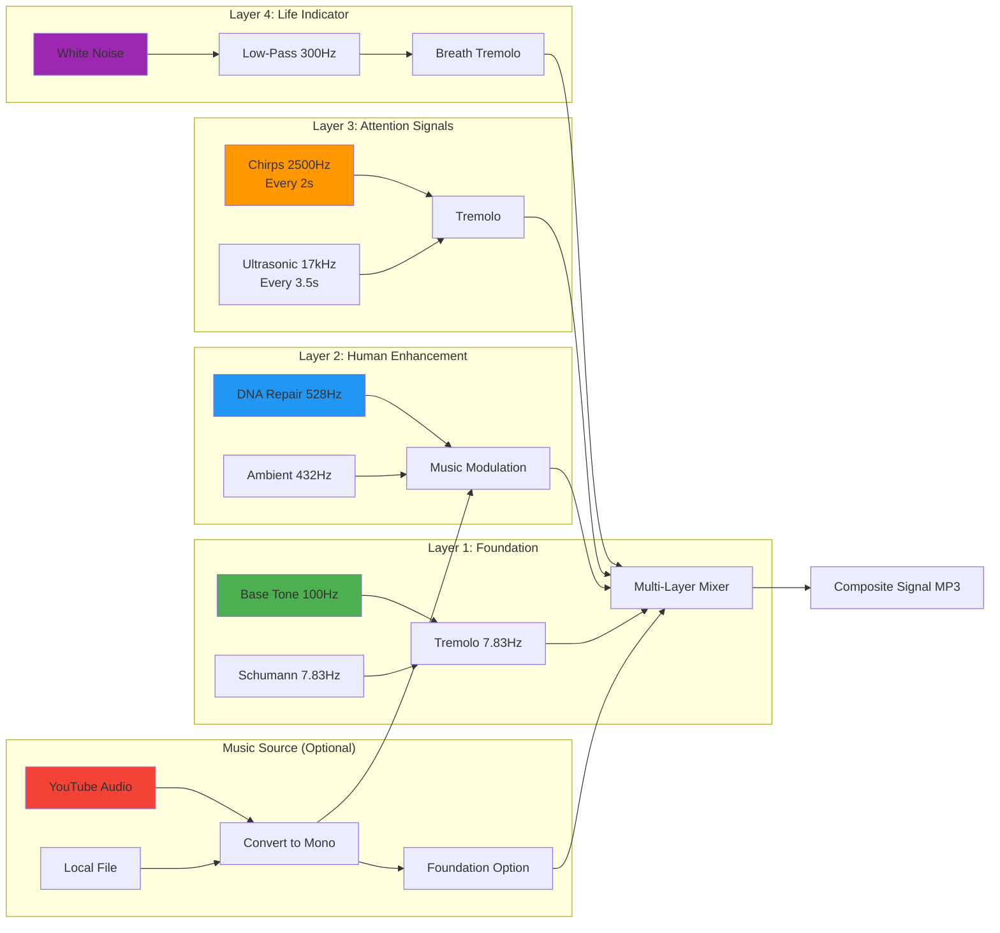

# UAP Signal Generator Dashboard

[](https://ultrasonic-sweep-f346d41ecd97.herokuapp.com/)
[](https://www.python.org/)
[](https://flask.palletsprojects.com/)
[](LICENSE)

🚀 **[Live Demo](https://ultrasonic-sweep-f346d41ecd97.herokuapp.com/)** | 📚 **[Documentation](https://ultrasonic-sweep-f346d41ecd97.herokuapp.com/documentation)**

## Project Vision & Intent

This application represents a unique collaboration between human intuition and artificial intelligence to create a **hybrid communication signal** designed for potential contact with Unknown Aerial Phenomena (UAP). Unlike conventional signal generation, this project weaves together:

- **Mathematical precision** - Sacred frequencies, Schumann resonance, harmonic ratios
- **Human creativity** - Music modulation carrying emotion and cultural expression  
- **Living patterns** - Organic timing, breathing effects, and evolving harmonics
- **Collaborative intelligence** - Human vision guided by AI technical implementation

The core philosophy is that meaningful contact signals must demonstrate both **technological capability** and **conscious intention** - combining Earth's natural frequencies with human creative expression to create something that could not exist without both components.

### EU AI Act Compliance

This project was developed as a **human-AI collaborative system** in accordance with the EU Artificial Intelligence Act principles:

- **Transparency**: This README clearly states AI involvement (GitHub Copilot/Claude) in code generation and architectural decisions
- **Human Oversight**: All design decisions, frequency selections, and creative direction determined by human researcher
- **Accountability**: Human developer maintains full responsibility for application behavior and outputs
- **Risk Classification**: Low-risk AI system (creative/research tool, no automated decision-making affecting individuals)
- **Documentation**: Complete source code, decision rationale, and collaboration process documented in git history

**Human Contribution**: Signal design philosophy, frequency selection, preset configurations, user experience design, research direction  
**AI Contribution**: Code implementation, optimization algorithms, architectural patterns, debugging assistance

This collaborative approach demonstrates responsible AI development where human creativity and judgment remain central while leveraging AI capabilities for technical execution.

## Screenshots

### Dashboard & Configuration


*Signal visualization showing frequency spectrum over time (spectrogram view)*


*Real-time waveform display showing signal amplitude over time*

### Music Integration


*Frequency spectrum analysis showing signal components across time*


*Music integration section with Use Music Modulation toggle*

### Signal Generation


*Frequency configuration card section with tone frequency controls*


*Modulation settings card with Tremolo toggle and depth controls*

### Visualizations


*Complete music integration controls with modulation toggles and YouTube/file upload options*


*Music playback and download controls with Play, Pause, Stop, and Download buttons*

## Architecture Overview


## Signal Generation Flow


## Multi-Layer Signal Architecture



## Real-Time Visualization Pipeline


## What's Been Built

1. **Enhanced Signal Generation** (`uap_signal_generator.py`)
   - Amplitude modulation (AM) functions
   - Tremolo effects at Schumann resonance (7.83 Hz)
   - Hybrid multi-layer signal architecture
   - Music integration for intelligent signaling

2. **Signal Presets** (`signal_presets.py`)
   - 6 preset configurations:
     - Original UAP Dog Whistle
     - Music Enhanced Signal
     - Harmonic Focus
     - Earth Heartbeat
     - Pure Carrier Waves
     - Biological Mimic

3. **Flask Dashboard** (`app.py`)
   - Interactive web interface
   - Real-time signal generation
   - Music file upload and management
   - Custom tone configuration
   - Live oscilloscope visualization

4. **User Interface** (`templates/dashboard.html`)
   - Bootstrap 5 responsive design
   - Preset selection
   - Frequency controls
   - Modulation settings
   - Real-time waveform display
   - Download capabilities

## Installation

1. Ensure you're in the `.venv` environment:
   ```cmd
   .venv\Scripts\activate
   ```

2. Install required packages:
   ```cmd
   pip install -r requirements.txt
   ```

## Running the Dashboard

1. Start the Flask server:
   ```cmd
   python app.py
   ```

2. Open your browser to:
   ```
   http://localhost:5000
   ```

3. The server runs on all network interfaces (0.0.0.0:5000), so you can access from:
   - Local: `http://127.0.0.1:5000`
   - Network: `http://[your-ip]:5000` (e.g., `http://192.168.0.67:5000`)

**Note**: Debug mode is enabled for development. For production deployment, set `debug=False` and use a production WSGI server like Gunicorn.

## Usage Guide

### Quick Start with YouTube


1. Paste a YouTube URL into the "YouTube URL" field
2. Click "Download from YouTube" - audio extracts automatically
3. The downloaded audio auto-selects and enables "Use Music Modulation"
4. Select a preset (e.g., "Music Enhanced Signal")
5. Click "Generate Signal" and watch real-time progress
6. Visualizations update automatically when complete
7. Use playback controls to preview the signal
8. Click "Download Signal" to save as MP3


*Frequency configuration card section with tone frequency controls*

### Advanced Workflow


## Usage Guide (continued)

### Custom Configuration
- **Frequencies**: Adjust individual tone frequencies
  - Base Tone: 100 Hz (grounding foundation)
  - Schumann: 7.83 Hz (Earth's electromagnetic heartbeat)
  - DNA Repair: 528 Hz (Solfeggio healing frequency)
  - Ambient: 432 Hz (harmonic "universal" tuning)
  - Chirp: 2500 Hz (attention-grabbing frequency)
  - Ultrasonic: 17000 Hz (near upper limit of human hearing)

- **Modulation Settings**:
  - **Music Modulation**: Uses music amplitude to modulate carrier frequencies
  - **Music as Foundation**: Makes music the primary layer (vs synthetic tones)
  - **Tremolo**: Enable Earth heartbeat pulsing at Schumann frequency
  - **Tremolo Depth**: Control tremolo intensity (0-100%)

### Signal Architecture Explained


**Layer 1: Foundation (Steady, Natural)**
- Base tone and Schumann carrier with optional slow tremolo
- Represents Earth's natural electromagnetic frequencies
- Provides grounding and planetary awareness

**Layer 2: Human Enhancement (Music-Modulated)**
- DNA repair tone (528 Hz) and ambient pad (432 Hz) modulated by music
- Demonstrates intelligent creative enhancement of natural frequencies
- Music carries human emotion, culture, and conscious intention

**Layer 3: Attention (Pulsing/Organic)**
- Chirps with tremolo and ultrasonic pings repeated throughout
- Creates "alive" signaling quality - not mechanical, not random
- Establishes temporal patterns showing intentional design

**Layer 4: Life Indicator (Breath Layer)**
- Filtered white noise with tremolo effect
- Mimics biological breathing and organic life processes
- Adds subtle complexity suggesting living intelligence

### Music Modulation Explained

When music modulation is enabled, the amplitude (volume) of the music file is used to modulate the carrier frequencies in Layer 2. This creates a dynamic, evolving signal where:

1. **Music amplitude → Modulation depth**: Louder music = stronger modulation
2. **Harmonic coupling**: Music harmonics interact with carrier frequencies
3. **Cultural expression**: Music carries human creativity and emotion into the mathematical framework
4. **Temporal variation**: Creates non-repetitive, organic time-evolution

This demonstrates that the signal is not purely algorithmic - it carries genuine human creative expression woven into fundamental frequencies.

### Real-Time Visualizations

The dashboard provides three interactive visualization modes:


*Complete music integration controls with modulation toggles and YouTube/file upload options*


*Music playback and download controls with Play, Pause, Stop, and Download buttons*

Each visualization updates in real-time during playback (~60fps) using the Web Audio API:
- **Waveform**: Time-domain oscilloscope view
- **FFT Spectrum**: Frequency bars with labeled bands
- **Spectrogram**: Scrolling time/frequency heatmap

## Features

- **6 Signal Presets**: Pre-configured for different contact strategies
- **YouTube Audio Integration**: Paste any YouTube URL to extract audio for modulation
- **Real-time Progress Tracking**: Server-Sent Events show actual generation progress (0-100%)
- **Live Visualization**: Three-tab interface with Waveform, FFT Spectrum, and Spectrogram
- **Web Audio API Analysis**: Real-time frequency analysis during playback (~60fps)
- **Music Integration**: Upload MP3, MP4, WAV, FLAC, or M4A files or use YouTube
- **Custom Frequency Control**: Adjust all tone frequencies independently
- **Modulation Options**: Tremolo and amplitude modulation with depth control
- **Continuous Signal Layers**: Chirps (every 2s) and ultrasonic pings (every 3.5s) throughout
- **Audio Playback Controls**: Play, pause, stop with proper resume functionality
- **Download Signals**: Save generated signals as MP3
- **Responsive Design**: Works on desktop and mobile
- **Progress Opacity Animation**: Spinner fades from 20% to 100% opacity as work completes

## Installation

1. Ensure you're in the `.venv` environment:
   ```cmd
   .venv\Scripts\activate
   ```

2. Install required packages:
   ```cmd
   pip install -r requirements.txt
   ```

   **Key Dependencies**:
   - `flask>=3.0.0` - Web framework
   - `pydub>=0.25.1` - Audio manipulation
   - `numpy>=1.24.0` - Numerical processing
   - `scipy>=1.11.0` - Signal processing (FFT, Hilbert transform)
   - `yt-dlp>=2024.0.0` - YouTube audio extraction
   - `matplotlib>=3.7.0` - Visualization generation

3. **FFmpeg Required**: Ensure FFmpeg is installed at `C:\Users\Duncan\FFmpeg\bin\ffmpeg.exe`
   - Download from: https://ffmpeg.org/download.html
   - Or update path in `uap_signal_generator.py` line 17

## Technical Details

### Amplitude Modulation
Music amplitude modulates carrier frequencies (DNA repair 528 Hz, ambient 432 Hz), creating a pulsing effect that demonstrates intelligent enhancement of natural Earth frequencies. The modulation is applied using the Hilbert transform to extract the amplitude envelope:

```python
carrier_array * ((music_envelope - min) / (max - min))
```

This creates coupling between human musical expression and fundamental frequencies.

### Tremolo at 7.83 Hz
Applies Earth's Schumann resonance as a tremolo rate to multiple layers, creating the "heartbeat" effect. The tremolo uses a sine wave LFO (Low Frequency Oscillator):

```python
audio * (1 - depth + depth * sin(2π * 7.83Hz * t))
```

This shows awareness of planetary electromagnetic frequencies and creates an organic pulsing quality.

### Real-Time Progress Tracking
Uses Server-Sent Events (SSE) to stream progress updates from backend to frontend:


### Web Audio API Visualization
Real-time frequency analysis during playback using the Web Audio API:

```javascript
audioContext.createAnalyser()
analyserNode.fftSize = 2048  // 2048-point FFT
analyserNode.getByteTimeDomainData()  // Waveform
analyserNode.getByteFrequencyData()   // Spectrum
requestAnimationFrame(animate)        // 60fps loop
```

The spectrogram maintains a ring buffer of 100 frequency slices, creating a scrolling time/frequency visualization.

### YouTube Audio Extraction
Uses `yt-dlp` to extract audio from YouTube videos:

```python
ydl_opts = {
    'format': 'bestaudio/best',
    'postprocessors': [{
        'key': 'FFmpegExtractAudio',
        'preferredcodec': 'mp3',
        'preferredquality': '192',
    }]
}
```

Downloaded files are cached as `youtube_{video_id}.mp3` for instant reuse.

**⚠️ Important Note:** YouTube downloads work reliably on **local installations only**. The feature uses browser cookies for authentication, which work perfectly when running locally but may be blocked by YouTube's bot detection on hosted/cloud deployments. For the hosted version, please use the file upload option instead.

### Hybrid Approach Benefits
- **Multiple modulation types** for broader spectral coverage
- **Combines natural and artificial** signals showing technological capability
- **Creates organic "alive" quality** through tremolo and temporal patterns
- **Demonstrates intelligence** via harmonic relationships and cultural expression
- **Non-repetitive evolution** through music modulation prevents mechanical patterns
- **Human-AI collaboration** visible in the synthesis of mathematical and creative elements

## File Structure

```
Ultrasonic_Sweep/
├── app.py                      # Flask application with SSE progress tracking
├── uap_signal_generator.py     # Signal generation engine with progress callbacks
├── signal_presets.py           # 6 preset configurations
├── requirements.txt            # Python dependencies including yt-dlp
├── README_DASHBOARD.md         # This file - comprehensive documentation
├── templates/
│   └── dashboard.html          # Main UI with Bootstrap tabs and progress modal
├── static/
│   ├── css/
│   │   └── dashboard.css       # Custom dark theme styles
│   └── js/
│       └── dashboard.js        # Dashboard logic, Web Audio API, SSE handling
├── source_files/               # Music files (local uploads + YouTube downloads)
├── generated_signals/          # Output signals saved here as MP3
└── .venv/                      # Python virtual environment
```

## Collaboration & Attribution

### Human Contributions (ddeveloper72)
- **Conceptual Design**: UAP contact signal philosophy and multi-layer architecture
- **Frequency Selection**: All frequency values based on Schumann resonance, Solfeggio frequencies, sacred geometry
- **Preset Configurations**: Six distinct signal strategies for different contact scenarios
- **User Experience**: Dashboard layout, workflow design, visualization requirements
- **Research Direction**: Integration of music modulation as human expression carrier
- **Project Vision**: Hybrid human-AI collaborative communication framework

### AI Contributions (GitHub Copilot / Claude Sonnet 4.5)
- **Code Implementation**: Python signal generation, Flask API, JavaScript frontend
- **Architecture**: Multi-layer mixing algorithms, progress tracking system, SSE implementation
- **Optimization**: Web Audio API integration, real-time visualization performance
- **Technical Documentation**: Code comments, API documentation, architectural diagrams
- **Debugging**: Error resolution, dependency compatibility (Python 3.12.8, scipy 1.14.1)
- **Enhancement Suggestions**: YouTube integration, continuous signal layers, opacity animation

### Collaborative Process
This project demonstrates **responsible AI collaboration** where:
1. **Human sets intent and goals** - What to build and why
2. **AI implements technical solution** - How to build it efficiently  
3. **Human validates and directs** - Quality control and creative decisions
4. **AI adapts and refines** - Iterative improvement based on feedback
5. **Human maintains accountability** - Final responsibility for all outputs

The git commit history provides complete transparency of this collaboration, showing the evolution from initial concept to production-ready application.

## EU AI Act Compliance Statement

**System Classification**: Low-risk AI system (General Purpose AI used for creative/research purposes)

**Transparency Disclosures**:
- AI tools used: GitHub Copilot, Claude Sonnet 4.5 (Anthropic)
- AI role: Code generation, technical implementation, optimization suggestions
- Human role: All design decisions, signal parameters, creative direction, final approval
- Collaboration documented: Complete git history with descriptive commits

**Human Oversight**:
- Human developer maintains full control over all generated code
- All AI suggestions reviewed and validated before implementation  
- Human responsible for application behavior and outputs
- No automated decision-making affecting individuals

**Risk Assessment**:
- No high-risk use case (not used for critical infrastructure, law enforcement, biometrics)
- No personal data processing
- Research and creative tool only
- Output signals are artistic/scientific expressions, not autonomous systems

**Documentation**:
- Source code fully documented and version controlled
- Architecture and decision rationale explained in README
- Dependencies and technical requirements specified
- Human-AI contribution boundaries clearly defined

This project serves as an example of **transparent, human-centric AI development** in accordance with EU AI Act principles of accountability, transparency, and human oversight.

## Next Steps & Future Enhancements

Potential areas for expansion:

### Signal Generation
- [ ] Add more preset configurations for different contact strategies
- [ ] Implement dynamic frequency shifting patterns
- [ ] Create batch generation for multiple signal variants
- [ ] Add scheduling for automated signal broadcasting
- [ ] Support additional export formats (WAV, FLAC, OGG)
- [ ] Implement stereo positioning for spatial effects
- [ ] Add harmonics generator for richer timbres

### Visualization
- [ ] 3D waterfall spectrogram display
- [ ] Phase coherence analysis visualization  
- [ ] Harmonic relationship graph
- [ ] Layer isolation/muting controls
- [ ] Comparative visualization of multiple signals
- [ ] Export visualization as video file

### User Interface
- [ ] Save/load custom configurations
- [ ] User accounts and signal library
- [ ] Collaborative signal design (multi-user)
- [ ] Mobile app version
- [ ] Accessibility improvements (screen reader support)
- [ ] Multi-language support

### Integration
- [ ] Direct broadcasting to SDR (Software Defined Radio)
- [ ] Integration with radio astronomy tools
- [ ] API for programmatic signal generation
- [ ] Plugin system for custom modulation algorithms
- [ ] MIDI controller support for live manipulation

### Analysis
- [ ] Signal complexity metrics
- [ ] Harmonic analysis and visualization
- [ ] Information density calculation
- [ ] Compare generated signals statistically
- [ ] Machine learning pattern detection in responses (if any)

## Research References & Theoretical Foundations

### Frequency Research
- **Schumann Resonance**: Earth's fundamental electromagnetic frequency (7.83 Hz)
  - König, H. L. (1974). "Behavioural changes in human subjects associated with ELF electric fields"
  - NASA studies on Schumann resonance in space exploration
  
- **Solfeggio Frequencies**: Ancient harmonic scale
  - 528 Hz: DNA repair frequency (Horowitz, L. "The Book of 528")
  - 432 Hz: "Universal" harmonic tuning (Verdi's A)
  - Mathematical relationships to golden ratio and sacred geometry

- **Bioacoustics**: Biological response to specific frequencies
  - Cymatics: Visual sound vibration patterns (Hans Jenny)
  - Ultrasonic communication in nature (cetaceans, bats)

### UAP Contact Theory
- **Original UAP Dog Whistle Project**: https://github.com/brycehelm/UAP_Dog_Whistle
  - Hypothesis: UAP may respond to specific frequency patterns
  - Community research and signal experimentation
  
- **Multi-Modal Communication**: Combining multiple signal types
  - Electromagnetic + acoustic + temporal patterns
  - Demonstrates technological capability and intention
  
- **SETI Principles**: Search for Extraterrestrial Intelligence methods
  - Pioneer plaque approach: universal mathematical constants
  - Arecibo message structure: layered information encoding

### Signal Theory
- **Amplitude Modulation**: Carrier frequency modulation techniques
  - Used in AM radio, telecommunications
  - Hilbert transform for envelope extraction
  
- **Fourier Analysis**: Frequency domain representation
  - Fast Fourier Transform (FFT) for spectrum analysis
  - Time-frequency analysis via spectrograms

- **Human-AI Collaboration Research**
  - Collaborative creativity frameworks
  - AI as creative partner vs. tool
  - Transparency and accountability in AI systems

### Ethical & Legal Framework
- **EU Artificial Intelligence Act (2024)**
  - Risk-based classification framework
  - Transparency and documentation requirements
  - Human oversight mandates for AI systems
  
- **Responsible AI Development**
  - Partnership on AI guidelines
  - IEEE Ethics of AI and Autonomous Systems
  - ACM Code of Ethics for AI practitioners

## Contact & Contributions

This is an open research project exploring human-AI collaboration in signal generation for potential UAP contact. Contributions, suggestions, and research collaborations are welcome.

**Developer Contact**:  
- GitHub: [ddeveloper72](https://github.com/ddeveloper72)
- X/Twitter: [@DGFalconer](https://x.com/DGFalconer)
- LinkedIn: [Duncan Falconer](https://www.linkedin.com/in/duncanfalconer/)
- Project Repository: [Ultrasonic_Sweep](https://github.com/ddeveloper72/Ultrasonic_Sweep)

**Project Philosophy**: Transparent collaboration between human intuition and AI capability to create signals that demonstrate both technological sophistication and conscious creative intention.

**Disclaimer**: This application is for research and experimental purposes. No claims are made about the effectiveness of these signals for UAP contact. The project explores the intersection of signal theory, human creativity, and collaborative AI development.

---

*"The most beautiful thing we can experience is the mysterious. It is the source of all true art and science."* - Albert Einstein

*Generated through human-AI collaboration: ddeveloper72 (Human) + GitHub Copilot/Claude (AI) - December 2024*

---

**Developer**: [GitHub](https://github.com/ddeveloper72) | [X/Twitter](https://x.com/DGFalconer) | [LinkedIn](https://www.linkedin.com/in/duncanfalconer/)  
**Project Repository**: [UAP Signal Generator](https://github.com/ddeveloper72/Ultrasonic_Sweep)
